## 💬 Introduction
I'm Stefanus Gusega Gunawan, currently studying at Institut Teknologi Bandung as an Informatics Engineering undergraduate student. I love machine learning, deep learning, and software engineering too.

## 🌱 Skills and Interests
Python, Numpy, TensorFlow, Machine Learning, Deep Learning, Speech Processing, Laravel, Data Science, Mathematics, Calculus

## 🏛️ Language Stats
<table>
    <tr>
        <td>
            
        </td>
        <td>
            
        </td>
    </tr>
</table>

## 💁‍♂️ More Information
<table>
    <tr>
        <td valign="center">
            
        </td>
        <td valign="center">
            
        </td>
    </tr>
</table>
<table>
    <tr>
        <td valign="center">
            
        </td>
        <td valign="center">
            
        </td>
    </tr>
</table>
